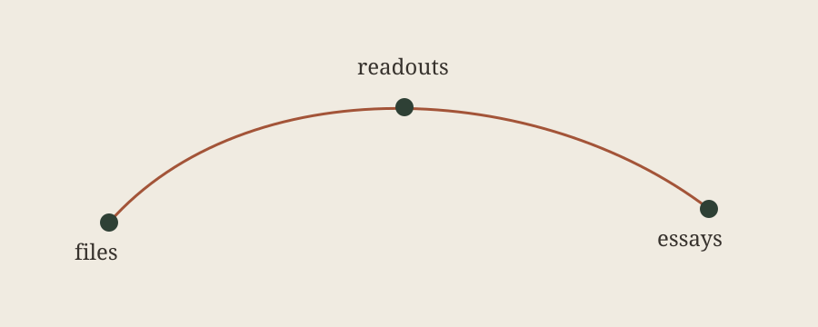
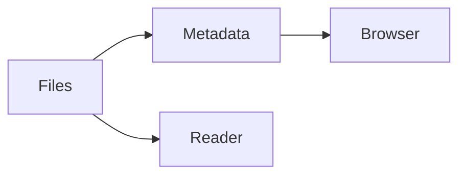

---
artifact:
  protocol: "1"
  schema: "field-lab/document"
  schemaVersion: "1"
  title: "Artifact Browser Field Note"
  role: "reading"
  representation: "document"
  renderingMode: "editorial"
  exposure: "checkpoint"
  instrument:
    id: "artifact-browser"
    family: "retain"
    contact: "record"
---

# Artifact Browser Field Note

This is a small working session with enough material to test the reader.

> A useful readout should be legible before it becomes formal.

## A compact inventory

- [x] Markdown and typography
- [x] Live filesystem metadata
- [x] Generic structured views
- [ ] Formal semantic renderers

| Facet | Example |
| --- | --- |
| Instrument family | `test` |
| Representation | `ledger` |
| Exposure | `checkpoint` |



Read the [structured record](./data.json) or inspect the diagram below.

```ts
const question = "What deserves a stable renderer?"
console.log(question)
```


